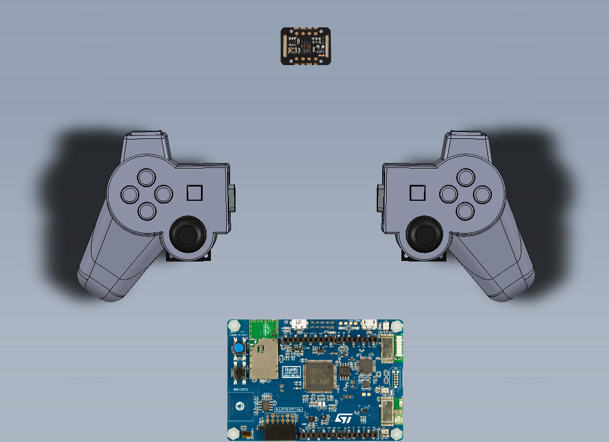
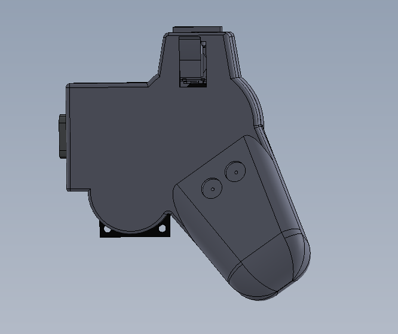
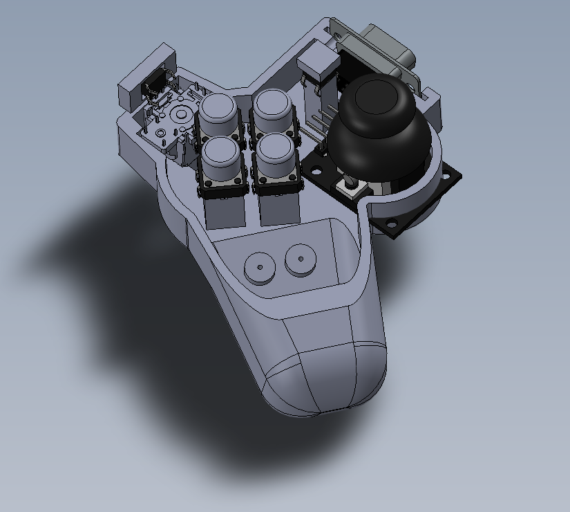

# FitnessController

This is an implementation of a BLE Gamepad. The purpose was to design a game pad that could be used while running on a treadmill. It would interface with a heartrate monitor strapped to someone's chest and it would pause your game and stop if your heart rate dropped below certain threshold. The microcontroller board is an B-L475E-IOT01A STM32 Discovery board. The firmware is a bare metal implementation of the "HID Over GATT" profile, which, at a minimum, requires a HID Service, Battery Service, and Device info service.

The mechanical design is my own, but it is clearly based on Sony's dual shock controller. I took a pair of calipers and took various measurements to imitate the design. Essentially I set out to cross the dualshock controller with a Wii Nunchuck by cutting a dual shock controller on the end and putting a D-Sub connector on the side. The joystick is an off-the-shelf joystick module which I cut the corners off of to make it fit in the housing. The triggers are also joystick modules, but turned upside down and mechanically secured such that it can only move along a single axis. This is a "PCBless" design, all the leads on the components are tied directly to the connector, and wires are spliced together so they can share power/ground signals.

Known Issues: The heart rate monitor is currently NYI as I attempt to debug a hardfault that occurs during initialization of the I2C bus. Currently it only works with Linux based devices, (Windows not yet tested), and does not work with iOS. The controller does not show up to pair with iOS devices when it advertises itself. Likely it does not meet Apple's security requirements, but I haven't found any iOS BLE HID developement guidelines from Apple so I don't know for certain. All I've found is: "BLE HID data is consumed at the OS Kernel level of iOS" which only explains why it won't show up using the LightBlue BLE scanner app.
